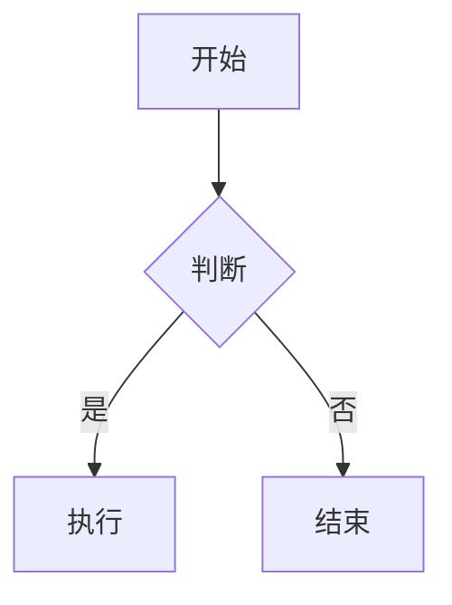
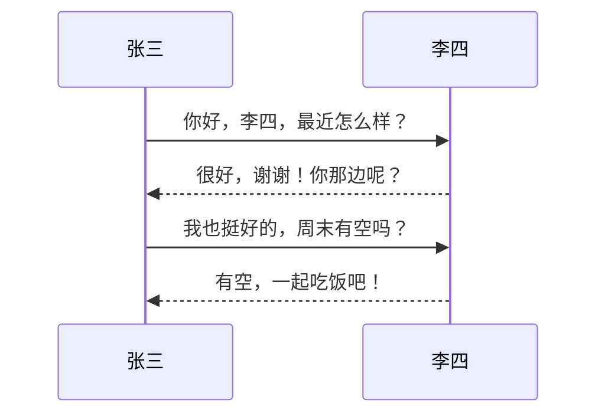
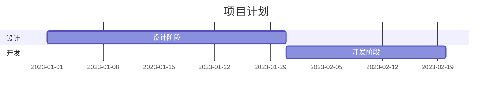

# 欢迎使用 MPS·文字 傻瓜式 Markdown 编辑器

本编辑器致力于提供类似 WPS 的 Markdown 编辑体验，智能、高效、易用。

## ✨ 核心特色

### 1. 智能样式切换
- 点击 **粗体** 按钮给文本添加粗体，再次点击该按钮 取消粗体，不会产生 `****text****` 的冗余标记。
- 同样适用于 *斜体*、~~删除线~~、`行内代码`、==高亮== 等。

### 2. 标题格式保护
- 在标题行（如 `# 标题`）应用样式时，自动识别并只作用于标题文本，不会破坏 `#` 标记。
- 例如：`# 标题` → 加粗后变为 `# **标题**`，而非 `**# 标题**`。

### 3. 上下角标智能识别
- 在普通文本中：使用 `^上标^` 或 `~下标~`。
- 在 LaTeX 公式内：自动转换为 `^{上标}` 或 `_{下标}`，符合数学排版规范。
- 示例：在公式 $E = mc2$ 中选中 `2` 点击上标，自动变为 $E = mc^{2}$。

### 4. 表格列级对齐
- 点击表格任意单元格，选择对齐方式（左/中/右），**只改变该列**的对齐，不影响其他列。
- 示例表格如下：

| 左对齐 | 居中 | 右对齐 |
| :--- | :---: | ---: |
| 1 | 2 | 3 |
| 4 | 5 | 6 |

### 5. 自动接续列表/任务
- 在列表项末尾按回车，自动插入下一项（有序列表自动递增序号）。
- 任务列表支持切换完成状态（点击切换任务按钮）。

## 📋 功能速览

### 任务列表
- [x] 已完成任务
- [ ] 待完成任务
- [ ] 另一个待办

### 嵌套引用与缩进
> 一级引用
>> 二级引用
>>> 三级引用

- 一级项目
  - 二级子项（缩进两个空格）
    - 三级子项

### LaTeX 公式
行内：$E = mc^2$

块级：
$$ \int_0^\infty e^{-x^2} dx = \frac{\sqrt{\pi}}{2} $$

### Mermaid 图表
#### 流程图

#### 时序图

#### 甘特图

### 自动接续演示
- 开启“自动接续”后，在此列表项末尾按回车，会自动插入下一项。
  - 子项同样支持自动接续（缩进保持）。
