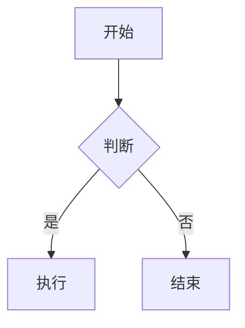
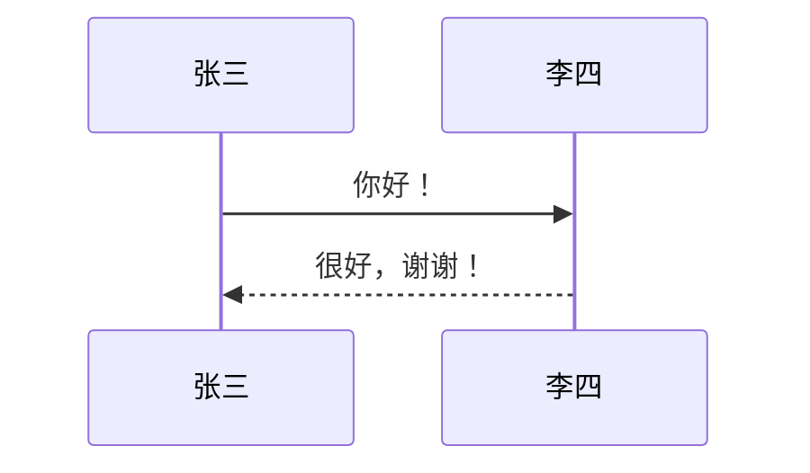

# 欢迎使用 MPS·演示

一个由 **Markdown 文档驱动** 的可视化演示。

## 分页规则

- `#` 一级标题 → 开启**新的一页**
- `##` 及更深层级标题 → 当前页的**断点**

### 点击推进

每点击一次，就显示下一个断点。

## 完全兼容 Markdown

支持 **粗体**、*斜体*、~~删除线~~、==高亮==、`行内代码`、表格与任务列表。

> 引用块也完全支持。
>
> > 嵌套引用同样没问题。

# 公式与图表

## LaTeX 公式

行内公式 $E = mc^2$，以及块级公式：

$$ \int_0^\infty e^{-x^2}\,dx = \frac{\sqrt{\pi}}{2} $$

## 流程图



## 时序图



# iframe 播放器（插件）

## 需要先在「插件管理」中开启

把第三方平台的播放器直接嵌进幻灯片：哔哩哔哩、网易云音乐（单曲 / 歌单）、
YouTube、Vimeo，或者任意 iframe 地址。开启时工具栏会多出「iframe 播放器」选项卡，
各平台一键插入；关闭时代码块以源码形式呈现。

```iframe
bilibili BV1r7et6PEVQ
title 哔哩哔哩播放器（把 BV 号换成你的）
```

## 网易云音乐

`netease` 是单曲，`netease-playlist` 是歌单，参数都填数字 ID。

```iframe
netease 26092806
title 网易云单曲（把 ID 换成你的）
```

## 直接粘贴其他平台的嵌入代码

从其他平台复制的整段 `<iframe …></iframe>` 代码可以直接粘进 `iframe` 代码块：
`src`、宽高（`width` / `height` / `style`）、`allow` 等属性会自动识别，
块内还可以写 `ratio` / `height` / `title` 行来覆盖识别结果。

```iframe
<iframe src="//player.bilibili.com/player.html?bvid=BV1r7et6PEVQ" scrolling="no" frameborder="no" style="width: 800px;height: 450px;" allowfullscreen="true"></iframe>
```

# 数学动画（插件）

## 需要先在「插件管理」中开启

「数学动画」是一个**默认关闭**的插件。在「插件管理」选项卡里开启后，
下面的代码块才会渲染为动画；关闭时它以源码形式呈现。

开启后，工具栏会出现「数学动画」选项卡（官方教程 / 场景模板 / 重播动画）。

```manim
axes -4 4 -2 2.4
grid
plot f "sin(x)" -4 4 color=#58a6ff
math lb "y=\sin(x)" at -2.2 1.85
dot d at 0 0 color=#f78166 r=0.09
line l 1.57 0 1.57 1 color=#8b949e
play create f run=1.6
play write lb run=0.8
play fadein d run=0.5
play MoveAlongPath d f 0 1.57 run=1.6 rate=linear
play create l run=0.3
```

# Python 笔记本（插件）

## 需要先在「插件管理」中开启

「Python 笔记本」默认关闭（它内置了约 14MB 的 Python 运行时，按需启用）。
开启后，下面的代码块会变成一个**反应式笔记本**：

- 单元格用 `# %%` 分隔，也可以直接粘贴 marimo 的 `@app.cell` 格式；
- 依赖关系自动推导，按依赖顺序运行，**改上游单元格下游会自动重算**；
- 打开幻灯片即自动跑一次，顶栏「↻ 重跑」用于从头再来；
- 底部的「＋ 新增单元格」可以在演示现场随手加代码，翻页来回都还在。

```marimo
# %% 定义
import math
radius = 2.5
area = math.pi * radius ** 2

# %% 输出：把上面的 radius 改成 4，这里会自动重算
print(f"半径 {radius} 的圆面积 = {area:.3f}")
area
```

# 摄像头画面（插件）

## 需要先在「插件管理」中开启

「摄像头画面」默认关闭。开启后，下面的代码块会在舞台上叠出一块摄像头窗口：
拖动画面移动、拖动边缘缩放，悬停工具条可切换 8 种遮罩形状（圆形 / 椭圆 / 六边形 / 星形…）、
镜像与摄像头。

```camera
at 68 6
size 26 38
mask circle
label 讲师画面
```

# 课堂测验（插件）

## 需要先在「插件管理」中开启

「课堂测验」默认关闭。开启后，下面的代码块会变成可交互测验（选完点「提交」再判定），
工具栏会出现「课堂测验」选项卡；作答跨页累计，最后一页可放全卷成绩单。

```quiz
title 随堂小测
q 计算 \(\frac{1}{2}+\frac{1}{3}\) 的结果。
type single
opt \(\frac{5}{6}\) *
opt \(\frac{2}{5}\)
opt \(\frac{1}{5}\)
opt \(\frac{1}{6}\)
explain 通分：\(\frac{3}{6}+\frac{2}{6}=\frac{5}{6}\)。

q 以下哪些数属于质数？
type multi
opt 2 *
opt 3 *
opt 4
opt 9

q 三角形内角和等于 180 度。
type judge
ans 对

q 水的化学式是 ____，一个水分子由两个 ____ 组成。
type fill
ans H2O | H₂O ; 氢原子 | 氢 | H
explain 每个水分子由 2 个氢原子和 1 个氧原子构成。
```

## 全卷成绩单

```quiz-summary
title 本卷成绩
```

# 现场投票（插件）

## 与「课堂测验」是同一个插件

开启插件后，`poll` 代码块会显示题目 + 二维码：观众扫码在手机上投票，
票数与词云在幻灯片上实时刷新。**零配置即可用**（公共通道 + 自动房间）；
正式场合建议在 `poll-config` 里换成自己的 HiveMQ 集群（`broker` / `user` / `pass` / `room` / `vote`）。

```poll
title 现场投票
q 你平时用哪种工具写 Markdown？
type single
opt VS Code
opt Obsidian
opt Typora
opt 其他
```

# 互动模拟（插件）

## 需要先在「插件管理」中开启

「互动模拟」默认关闭。开启后，下面的代码块会变成**可现场操控的模拟**：
拖滑块实时改变参数，画面立刻响应；`开始 / 暂停 / 重置`、时间倍率、快照对比、导出 PNG / JSON
都在卡片下方的控制条里，工具栏会出现「互动模拟」选项卡。

## 内置模型：弹簧振子

内置 9 个模型（弹簧振子 / 单摆 / 抛体 / 传染病 SIR / 种群增长 / 捕食者 / 洛伦兹 / RC 充电 / 波的叠加）。
`snap 2` 表示每 2 秒（模拟时间）自动快照一次，用于前后对比。

```sim
title 弹簧振子
preset spring
project x v
snap 2
```

## 相图：捕食者与被捕食者

`view phase <横轴> <纵轴>` 画相图轨迹，`project` 决定左上角的投影读数。

```sim
title 捕食者与被捕食者
preset lotka
view phase prey pred
project prey pred
```

## 自定义方程

不写 `preset` 时，用 `state` 声明状态、`d` 写导数即可自定义模型，
表达式里可以用 `t`、参数名与 sin/cos/exp/abs 等函数。

```sim
title 阻尼受迫振动
state x 1
state v 0
param w 0.2 4 1.4 驱动频率 ω
param damp 0 1 0.1 阻尼
param F 0 3 0.8 驱动幅值 F
d x = v
d v = -x - damp*v + F*sin(w*t)
view time
project x v
```

## 链接序列：让演示自动流转

`next` 指定下一站（页码从 1 数起）、`after` 秒数到自动前进、`done` 等模拟结束再前进、
`inherit` 把本页参数继承给目标页（仅首次访问时生效）。

下面这份示例**只指定下一站**（点规则条上的按钮才跳转），不会在放映时自动翻页；
想去掉注释启用自动前进 / 参数继承即可。

```sim-link
# after 8      ← 停 8 秒后自动前进
# done         ← 等本页模拟结束再前进
# inherit      ← 首次进入目标页时继承本页参数
next 8
```

## 纳米模式：AI 绘图接口

`nano` 代码块是一个可现场重绘的插图卡（风格 / 种子 / 提示词）。
未接入 AI 服务时用内置的确定性生成器出图，完全离线；
接真实服务只需定义 `window.MPSNano.generateImage = async (req) => dataUrl`。

```nano
title 概念插图
ratio 16:9
style 渐变流体
seed 42
prompt 这里写提示词
```

# 一键打包

## 打包演示

点击「文件 → 打包演示」，即可把当前 Markdown 注入纯净引擎，生成本地 HTML，
得到**无编辑界面的纯净演示**。

# 结束

## 谢谢观看

点击右上角「📦 打包演示」可导出这个演示。